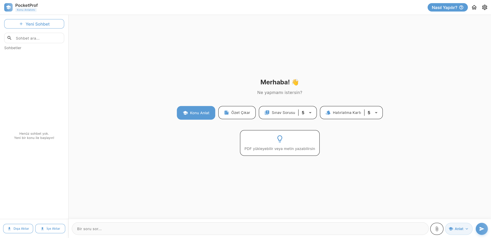
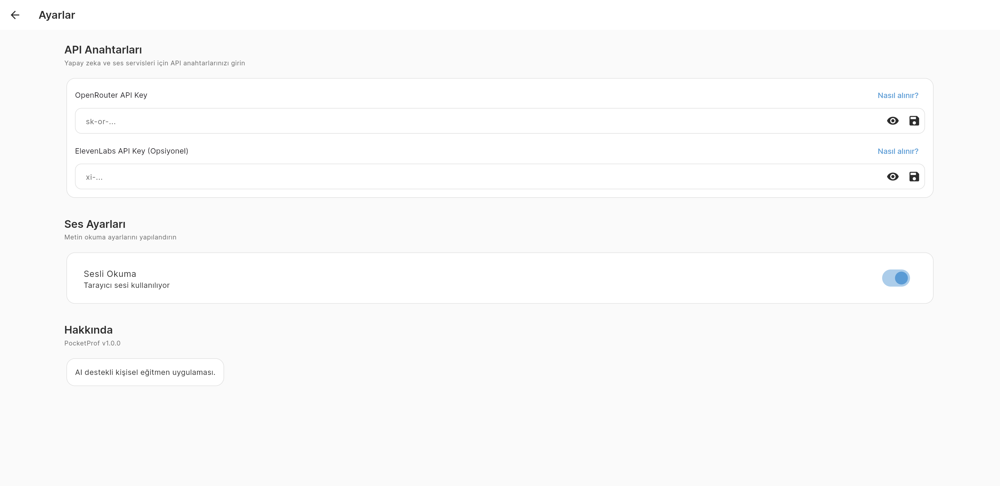
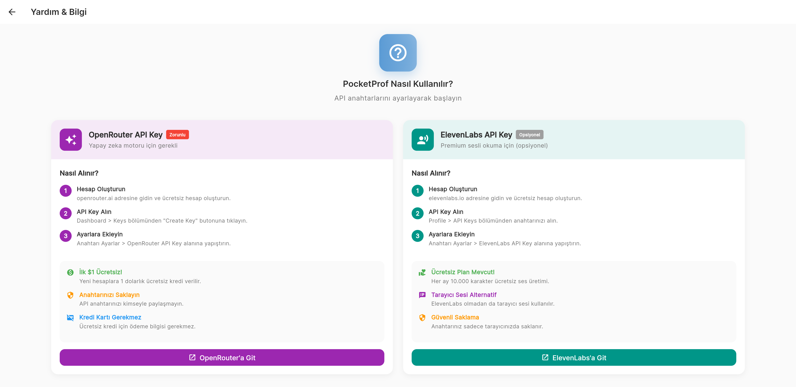

# 🎓 PocketProf - AI-Powered Personal Tutor


---

**PocketProf**, öğrencilerin ders çalışma süreçlerini yapay zeka ile optimize
eden, modern ve kullanıcı dostu bir web öğrenme asistanıdır. PDF dosyalarınızı,
görsellerinizi ve notlarınızı saniyeler içinde analiz eder; size özel sınavlar,
hatırlatma kartları ve konu anlatımları oluşturur.

🔗 **Canlı Demo:** [https://yusufesan.github.io/pocketprof](https://yusufesan.github.io/pocketprof)

## 📸 Ekran Görüntüleri

| Ana Sayfa | Ayarlar | Yardım Rehberi |
| :---: | :---: | :---: |
|  |  |  |

---

## ✨ Temel Özellikler

### 🤖 Akıllı AI Sohbet (Teacher Mode)

- **Çoklu Dosya Analizi:** Aynı anda birden fazla PDF ve görseli analiz edebilme
- **İleri Seviye Anlatım:** Karmaşık konuları basit örneklerle açıklayan
  pedagojik yaklaşım
- **Sürekli Hafıza:** Geçmiş sohbet oturumlarını saklar ve kaldığınız yerden
  devam etmenizi sağlar
- **Her Dosya İçin Ayrı Analiz:** Çoklu dosya yüklemelerinde her dosya bağımsız
  olarak işlenir

### 📝 Dinamik Quiz (Sınav) Oluşturma

- **Otomatik Soru Üretimi:** Kaynak dokümanlarınızdan anında test soruları
  oluşturur
- **Zorluk Seviyeleri:** Kolay, Orta ve Zor seçenekleri
- **Detaylı Açıklamalar:** Her yanlış cevapta AI geri bildirimleri

### 🎴 İnteraktif Hatırlatma Kartları (Flashcards)

- **Hızlı Öğrenme:** Dokümanlardaki kilit kavramları otomatik olarak kartlara
  dönüştürür
- **Premium Tasarım:** Glassmorphism temalı, kullanımı keyifli kart arayüzü
- **İpucu Desteği:** Zorlandığınızda AI'dan küçük ipuçları alabilme

### 🎙️ Sesli Destek (Hocayı Dinle)

- **ElevenLabs Entegrasyonu:** Premium kalitede yapay ses
- **Tarayıcı Sesi:** ElevenLabs olmadan da Web Speech API ile sesli okuma
- **Modern Oynatıcı:** İleri/geri sarma özellikli ses çubuğu

### ❓ Yardım Ekranı (v2.0 - Yeni!)

- **API Key Rehberi:** OpenRouter ve ElevenLabs için adım adım kurulum
- **Ücretsiz Kredi Bilgisi:** İlk $1 ücretsiz OpenRouter kredisi
- **Güvenlik İpuçları:** Anahtar saklama ve gizlilik bilgileri

---

## 🗂️ Gelişmiş Sohbet Yönetimi

- **Sohbet Arşivi:** Tüm eski sohbetleriniz sol panelde liste halinde
- **Sidebar Arama:** Sohbetler arasında hızlı arama
- **Dışa Aktar (Export):** Sohbet geçmişinizi Markdown formatında indirin
- **İçe Aktar (Import):** Yedeklediğiniz sohbetleri JSON formatında yükleyin
- **Güvenli Silme:** Sohbetlerinizi tek tek silebilme

---

## 🎨 Tasarım ve Kullanıcı Deneyimi

- **Premium Renk Paleti:** Canlı mor tonları ve yumuşak geçişler
- **Responsive Tasarım:** Desktop ve mobil uyumlu
- **Dinamik Animasyonlar:** Akıcı sayfa geçişleri ve efektler
- **Dark/Light Mode:** Tema desteği

---

## 🛠️ Teknoloji Yığını

| Teknoloji      | Kullanım                    |
| -------------- | --------------------------- |
| Flutter Web    | Cross-platform framework    |
| Riverpod       | State management            |
| OpenRouter API | LLM (Gemini, GPT-4, Claude) |
| ElevenLabs API | Text-to-Speech              |
| Hive           | Local storage               |
| Syncfusion PDF | PDF text extraction         |

---

## ⚙️ Kurulum ve Çalıştırma

### 1. Depoyu Klonlayın

```bash
git clone https://github.com/YusufEsan/pocketprof.git
cd pocketprof
```

### 2. Bağımlılıkları Yükleyin

```bash
flutter pub get
```

### 3. Çalıştırın

```bash
flutter run -d chrome
```

### 4. API Anahtarlarını Ekleyin

- Ayarlar (⚙️) menüsünden API anahtarlarınızı girin
- Veya Yardım (❓) butonundan nasıl alınacağını öğrenin

---

## 🔑 API Key Alma

### OpenRouter (Zorunlu)

1. [openrouter.ai](https://openrouter.ai/keys) adresine gidin
2. Ücretsiz hesap oluşturun (İlk $1 ücretsiz!)
3. Dashboard > Keys > Create Key
4. Anahtarı Ayarlar ekranına yapıştırın

### ElevenLabs (Opsiyonel)

1. [elevenlabs.io](https://elevenlabs.io/api) adresine gidin
2. Ücretsiz hesap oluşturun (10.000 karakter/ay ücretsiz)
3. Profile > API Keys
4. Anahtarı Ayarlar ekranına yapıştırın

---

## 🔒 Gizlilik ve Güvenlik

- ✅ Tüm veriler sadece tarayıcınızda saklanır (IndexedDB/Hive)
- ✅ API anahtarlarınız hiçbir sunucuya gönderilmez
- ✅ Sohbet geçmişi harici bir yere kaydedilmez
- ✅ Açık kaynak kod - şeffaflık

---

**PocketProf** - _Bilgiyi cebinize indirir, öğrenmeyi özgürleştirir._ 🚀
